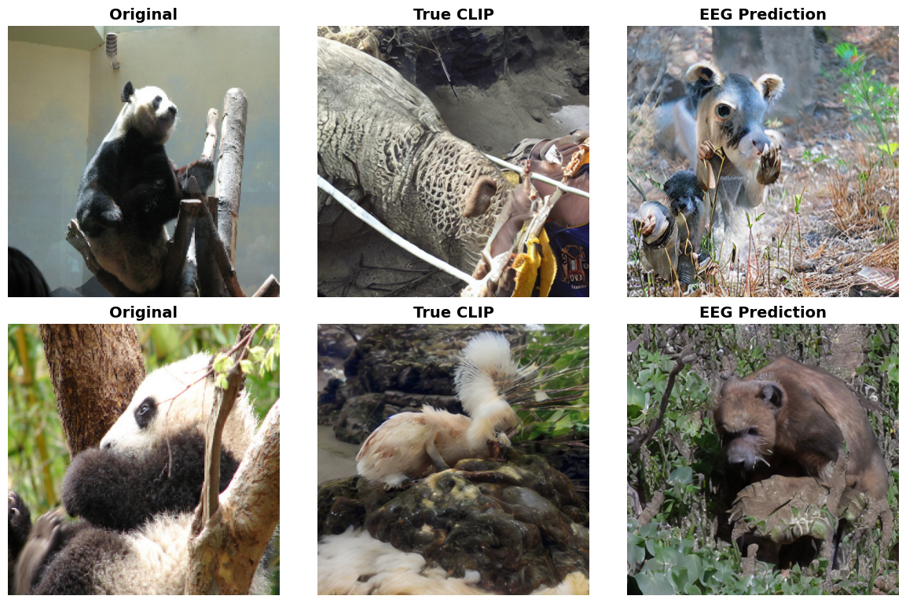

# Multimodal Learning Alignment of Brain Activity Representations

## Overview

This project explores transformer-based models for interpreting **human EEG signals** recorded during the observation of images. The ultimate goal is to reconstruct meaningful representations of the observed images from EEG data, alignment with CLIP embedding, enabling image generation via diffusion models using only brain activity.

We propose and compare two main approaches:
- **EEG-to-Image**: Aligning model outputs with image CLIP embeddings.
- **EEG-to-Text**: Aligning model outputs with textual description CLIP embeddings.

## Objectives

- Develop transformer-based models to interpret EEG signals and reconstruct image/text representations.
- Enable image generation from EEG using diffusion models.
- Compare approaches aligning EEG with image CLIP embeddings vs. text CLIP embeddings.

## Dataset

We use the [EEG_Image_CVPR_ALL_subj](https://huggingface.co/datasets/luigi-s/EEG_Image_CVPR_ALL_subj) dataset:
- 11,940 EEG samples from 6 subjects.
- Each EEG corresponds to: image from a subset of ImageNet and its textual description.
- EEGs shape: 128 channels (spatial dimension), 440 time points (temporal dimension).
- Data split into **train**, **validation**, and **test**.

## Model Architectures

### EEGFormer (EEG-to-Image)
- Initial convolutional network for feature extraction.
- Three transformer blocks:
  - Regional Transformer: Attention on embedding dimension.
  - Synchronous Transformer: Attention on spatial dimension.
  - Temporal Transformer: Attention on temporal dimension.
- Weighted pooling 
- Final projection to 1024-dim CLIP image embedding.

### NervFormer (EEG-to-Image)
- Sinusoidal positional encoding.
- Transformer encoder on temporal dimension.
- Parallel convolution + MHA on spatial and temporal dimensions.
- Projection to 1024-dim CLIP image embedding.

### EEGNetTransformer (EEG-to-Text)
- CNN-based feature extraction.
- Transformer encoder for temporal dependencies.
- Upsampling to match text token sequence length (77 tokens × 768 dim).

## Training & Testing

- Training and validation use PyTorch Lightning for reproducibility and checkpointing.
- Loss functions: MSE, Cosine Similarity, Contrastive Loss, and combinations.
- Metrics: MSE, Cosine Similarity, per-token metrics for text.
- Testing includes image generation using Stable Diffusion pipelines conditioned on predicted embeddings.

## Results & Evaluation

- Quantitative metrics: MSE, Cosine Similarity, per-token Similarity.
- Qualitative results: Generated images compared to ground truth and text prompts.
- Inspired by the metrics used in GWIT paper the N-way Top-k Accuracy Score was measured, it uses image classification models (ImageNet-1k) to assess subject identity in generated images.

  
  

<table align="center">
  <tr>
    <td align="center">
       
      <b>EEGNetTransformer, Text‑Embed</b>
    </td>
    <td align="center">
       
      <b>NervFormer, Image‑Embed</b>
    </td>
  </tr>
  <tr>
    <td align="center">
       
      <b>EEGFormer MSE Loss, Image‑Embed</b>
    </td>
    <td align="center">
       
      <b>EEGFormer Contrastive Loss, Image‑Embed</b>
    </td>
  </tr>
</table>

## References Papers

1. [EEGformer](https://www.frontiersin.org/journals/neuroscience/articles/10.3389/fnins.2023.1148855/full#F2): A transformer–based brain activity classification method using EEG signal.
2. [NECOMIMI](https://arxiv.org/abs/2410.00712): Neural-Cognitive Multimodal EEG-informed Image Generation with Diffusion Models.
3. [EEGNet](https://arxiv.org/abs/1611.08024): A Compact Convolutional Network for EEG-based Brain-Computer Interfaces.
4. [Guess What I Think](https://arxiv.org/abs/2410.02780): Streamlined EEG-to-Image Generation with Latent Diffusion Models.

## Tech Used
    

## Contributors

- [Giuseppe Misuraca](https://github.com/GiuseMisu)
- [Lorenzo Ciapetta](https://github.com/LorenzoCiappetta)
